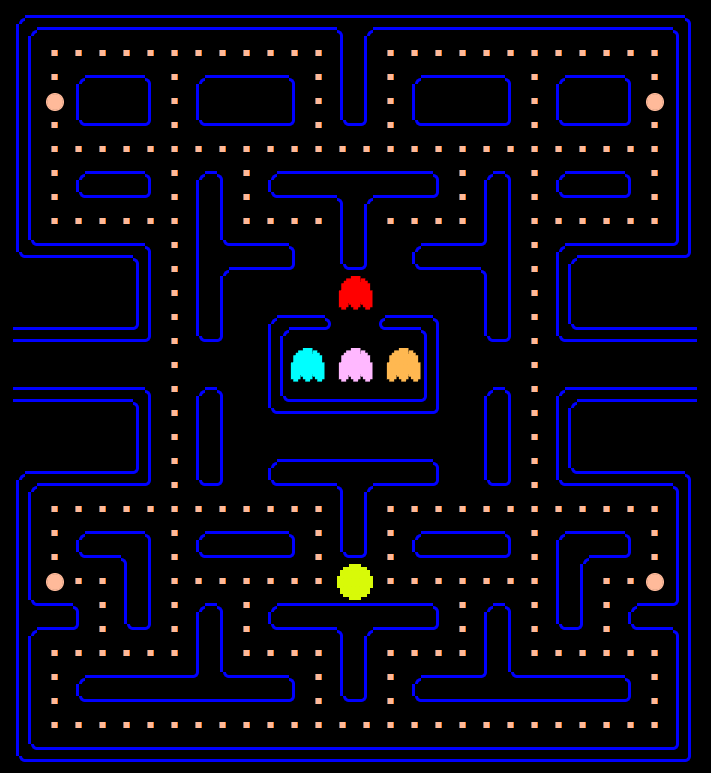
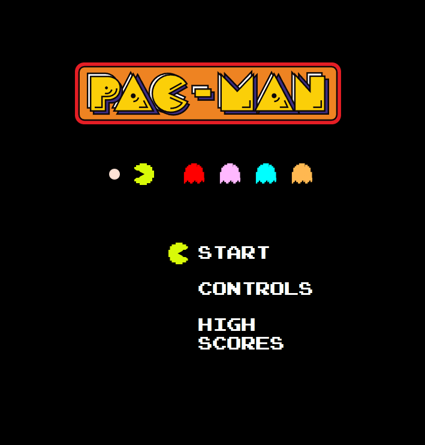
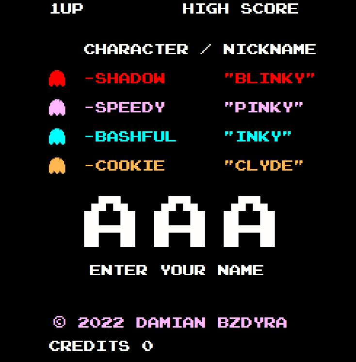

# PACMAN

#

## About

The goal of this project was to create a clone of Midway Manufacturing's 1980 arcade classic **Pacman**. You play as the yellow, gluttonous menace, _Pacman_, whose only goal is to gobble up all of the snack pellets on the board -- but it's not as easy as it seems. You'll have to avoid a pack of ghosts chasing after you, one wrong move and it's game over. Do _you_ have what it takes to outsmart them and swallow up all the pellets?

Click [HERE](https://pacman-alpha.netlify.app/) to test your skills.

#

## Controls

Use the arrow keys to move around the game board to eat the pellets and evade the ghosts. On the start/end screens press the _right arrow key_ to make your selection.

## Ruleset

- Collect all of the snack pellets to win.
- If the ghosts touch you, you will lose a life and return to the original start position.
  - If you run out of lives, it is game over.
- Eating the large snack pellet will grant you 5 seconds of invulnerability
  - During this time, you may eat the ghosts. This will cause the ghosts to despawn.
  - Ghosts will respawn inside of the center box immediately following the end of the 5 seconds.

## Points

- Each small snack pellet is worth **10 points**
- Each large snack pellet is worth **50 points**
- Eating a ghost is worth **200 points**
  - If you eat multiple ghosts while the timer is running, the point value will change
    - Second ghost eaten is worth **400 points**
    - Third ghost eaten is worth **800 points**
    - Fourth ghost eaten is worth **1600 points**
- For every 10,000 points reached, you will gain an extra life

#

## Technologies Used

- Javascript
- HTML
- CSS
- Bootstrap --> Modals
- Whimsical
  - [Link to Wireframe](https://whimsical.com/pac-man-8iDkN1ptGUYkMqAhqQfbA4)

#

## Future Tasks

- [ ] Responsive Design
- [ ] Cached High Scores
- [ ] Fruit Implementation
- [ ] Different movement algorithms for each ghost
- [ ] requestAnimationInterval instead of setInterval
- [ ] Difficulty to ramp up with each new board

#

## Shout-Outs

### Assets

- Pacman Logo taken from [LogoPedia](https://logos.fandom.com/wiki/Pac-Man)
- Font taken from [Font Space](https://www.fontspace.com/category/pixel,nintendo,pacman)

### Play Testers

- Nate Morgan
- Steph Michael
- Jess Landis
- Tia Maureen
- Ebba S

#

## Additional Screenshots

Start Screen

End Screen

